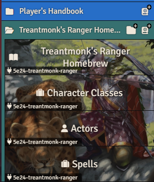
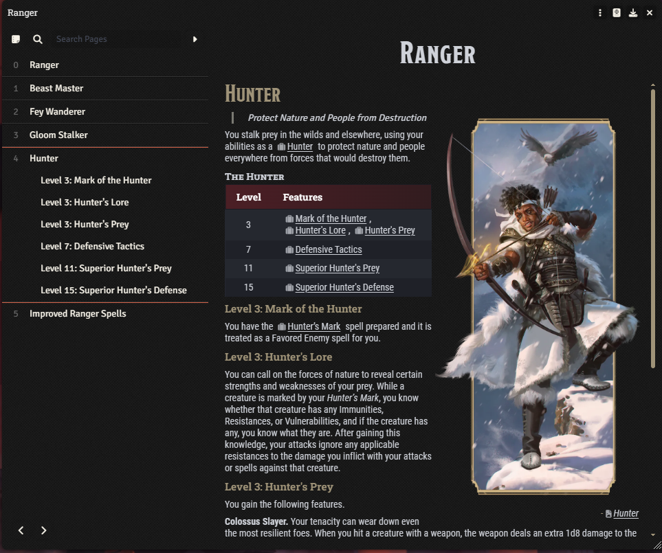
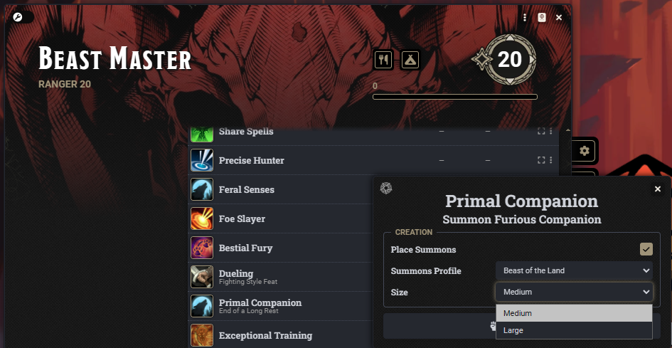

# Treantmonk's Ranger Homebrew

A Foundry VTT module implementing [Treantmonk's 2024 Ranger homebrew](https://henry-malinowski.github.io/5e24-treantmonk-ranger/) a rework for the 5.5e PHB Ranger with rebalanced features, revised spells, and functional Primal Companions. ([original Google Doc](https://docs.google.com/document/d/11tctNmoKT5Fw35yLKoG0oy9wWlC_nWEqja_atnoe_uY/)).

_Features unchanged from the PHB are pulled in from the official from the D&D 2024 Player's Handbook module._

## Features

- Revised Ranger class with 4 subclasses: Beast Master, Fey Wanderer, Gloom Stalker, Hunter
- Improved Primal Companion stat blocks for higher level Beast Masters
- 6 revised Ranger spells integrated into the dnd5e compendium browser
- Automations around new features
  - **Precise Hunter** grants Advantage on all attack rolls at level 17
  - _Summon Fey_ is treated as cast 2 spell levels higher for **Fey Reinforcements**
  - Modified Exhaustion penalties from **Tireless (endurance)** is accounted for
  - **Primal Steed** allows you to select size when summoning your _Beast of the Land_ or _Sea_ one size larger than the Ranger as a mount; Beast of the Sky comes in at level 11

## Examples

### Compendium Packs

### Revised Journals

### Precise Hunter advantage hinting

### Primal Companion size selection

## Dependencies

- [D&D 2024 Player's Handbook](https://www.foundryvtt.store/products/dnd-2024-players-handbook) (v2.1.0+)
- [libWrapper](https://foundryvtt.com/packages/lib-wrapper) (v1.13.3.0+)

## Installation

To install, paste the following URL into the **Install Module** dialog on the Setup menu of Foundry VTT:

`https://github.com/henry-malinowski/5e24-treantmonk-ranger/releases/latest/download/module.json`

If you wish to manually install the module, you must clone or extract it into your `Data/modules/5e24-treantmonk-ranger` folder. You may do this by cloning the repository or downloading a zip archive from the [Releases Page](https://github.com/henry-malinowski/5e24-treantmonk-ranger/releases).
